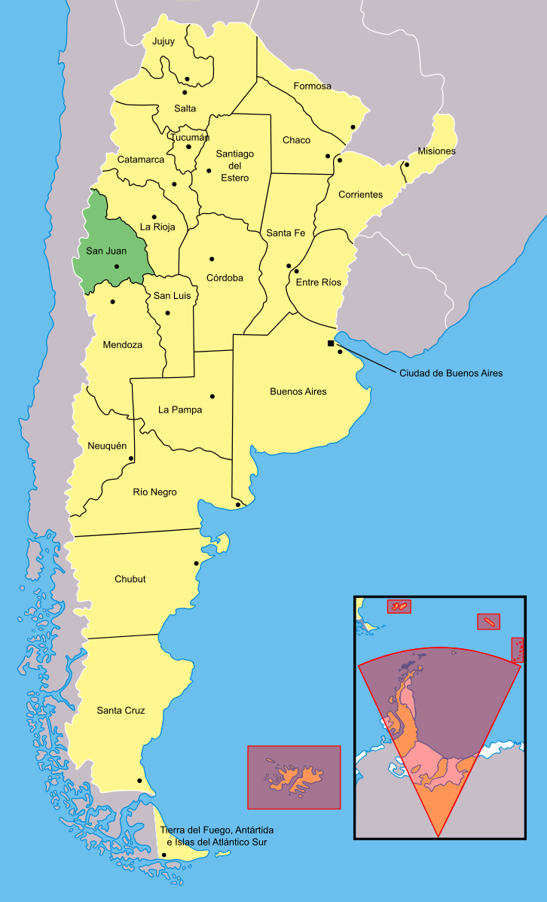
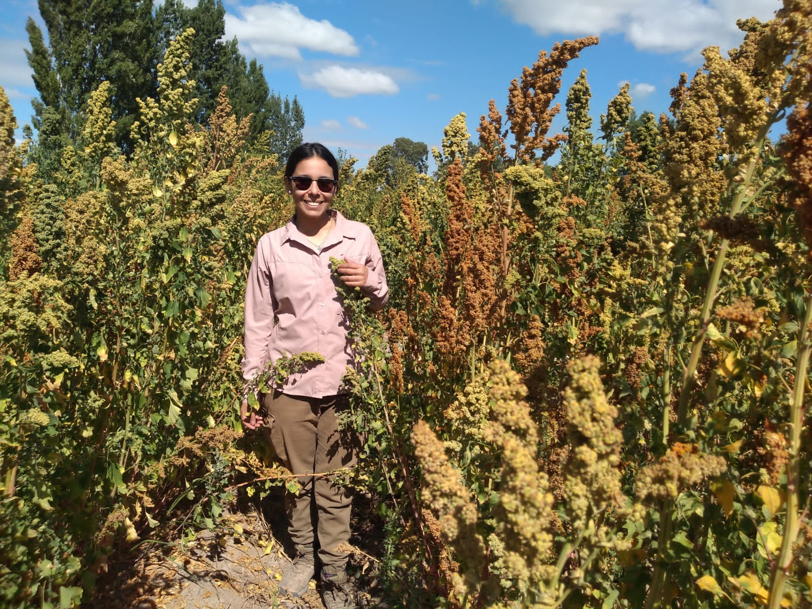

```{r setup, include=FALSE}
knitr::opts_chunk$set(echo = TRUE)
```
<style>
h1 { text-align: center; }
body { font-family: "Arial", sans-serif;color: black}
h1, h2 { font-family: "Times New Roman", serif; }
h2 {color: green;}
body {
    background-image: url("quinoa4.JPG");
    background-size: cover; /* Ajusta la imagen al tamaño de la pantalla */
    background-attachment: fixed; /* La imagen no se desplaza al hacer scroll */
    background-position: center; /* Centra la imagen */
      .background-overlay {
    background-color: rgba(150, 200, 270, 0.8); /* Fondo blanco con % de transparencia */
    position: absolute;
    top: 0;
    left: 0;
    width: 100%;
    height: 100%;
    z-index: -1; /* Asegura que el contenido quede por encima de la capa */
  }
  }
</style>
 <div class="background-overlay"></div>

## About me 

* I am from a small town called San Juan, located on the central west of Argentina

* I always thought that I was going to study medicine but at the last minute I changed because I love nature and I wanted to work outdoors

* My goal as a researcher is to make science accessible and practical to farmers.

* I have worked for 9 years with alternative crops such as Quinoa and Amaranth


<style>
  .image-container {
    display: flex; /* Alinea las imágenes en fila */
    justify-content: flex-start; /* Alinea hacia la izquierda */
    align-items: center; /* Centra verticalmente las imágenes */
  }

  .large-image {
    width: 30%; /* La imagen más grande ocupará el % del ancho */
    margin-right: 20px; /* Espacio entre la imagen grande y las pequeñas */
  }

  .small-image {
    width: 30%; /* Las imágenes pequeñas ocuparán el % del ancho */
    margin-right: 10px; /* Espacio entre las imágenes pequeñas */
  }
</style>

<div class="image-container">
  
  
  
</div>