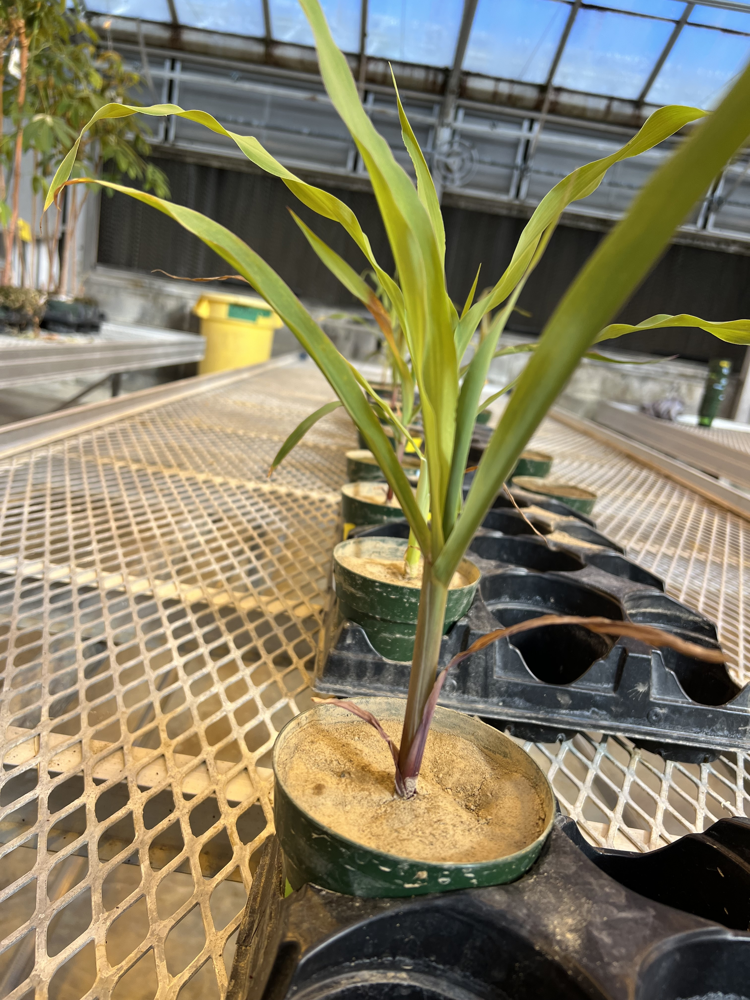
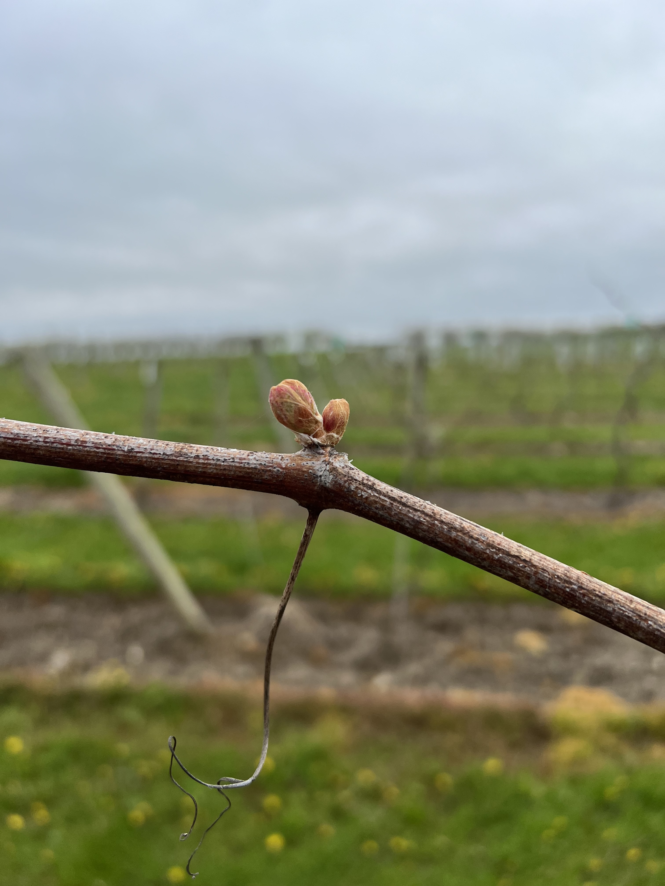

```{r setup, include=FALSE}
knitr::opts_chunk$set(echo = TRUE)
```

## Andrea Sanchez P.

* I'm from Chile

* 3rd year Ph.D student in the School of Integrative Plant Science, Horticulture section.

* My work is based in the physiological plant mechanisms of plant tolerance under abiotic stress.

* Currently, I'm using as plant models maize and grapevine



<br>



